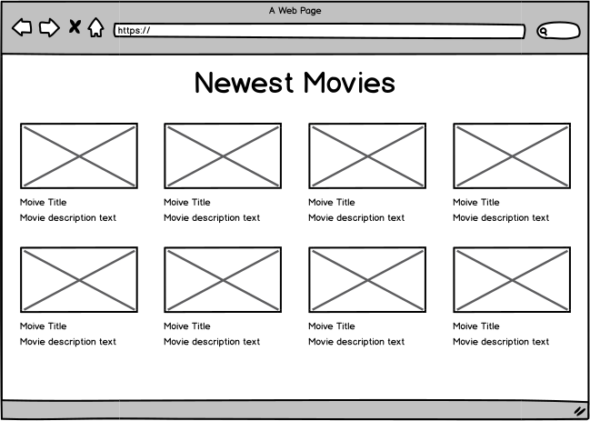

# React Course

## Hello World

Install create-react-app if you didn't already

    yarn global add create-react-app

Create a new App-Project

    create-react-app movie-reviews
    cd movie-reviews
    yarn start

Now open the folder in your favourite IDE or editor and open App.js in the src/

Change "App-title" to Hello World

Changes should immediately be visible in the browser.

Now eject Webpack

    yarn run eject

Notice the changes that took place after ejecting the app.

Remove the call to `registerServiceWorker()` from [`src/index.js`](src/index.js).

Now let us prepare the workplace for developing the app.
Change the file structure of your /src according to the following.
Some of the folders are staying empty for the moment but we're going to use them soon.

    src/
      __fixtures__/
      assets/
        images/
          logo.svg
      components/
        App/
          App.js
          App.test.js
      config/
      state/
        movies/
        user/
      styles/
        App.css
        index.css

Do the refactoring needed to make the app work again.

Read the [Readme](create-react-app-readme.md) and follow the instructions up to
(not including) adding Bootstrap.

## First Component

#### Task

Display a list of movies in a grid. It should look like this:

#### Steps

Download the `movies/GET.json` mock data from [Github](https://github.com/sbaechler/movie-mock-data/blob/master/data/movies/GET.json)
and copy it into the `__fixtures__` folder. Rename it to movies.json.

For today's excercises we import the required data directly from the JSON file. Have a look
at the JSON file, it represents the response from the API server that we are going to use on
day 2.

The server data contains a list of movies. Each movie has a poster image. The URL however is
not complete. It contains a common prefix that we have to define in the constants.

Create the file `config/constants.js` with the following content:

    export const POSTER_BASE_URL='https://image.tmdb.org/t/p/';

    export const POSTER_SIZES = {
      92: 'w92',
      342: 'w342',
      500: 'w500',
      780: '780',
      'original': 'original',
    };

Import the data in App.js like this:

    import mockData from '../../__fixtures__/movies.json';

    const movies = mockData.results;

Create the `MovieList` component. It should render a list of `MovieListItems` in a grid.

Create the `MovieListItem` component. It should take a single prop `movie` and display it.
The URL for the image src attribute can be build with the following template string:

    `${POSTER_BASE_URL}/${POSTER_SIZES["342"]}/${movie.poster_path}`;

For the protype styling we use the [Foundation](https://foundation.zurb.com/sites/) framework.

Install Foundation

    yarn add foundation-sites

Download the foundation settings file from this page. Click on 'Download Settings File'.
[Zurb](https://foundation.zurb.com/sites/docs/sass.html#compiling-manually)
Copy the file into the styles folder.

Remove the existing css files and create a new `index.scss` and `_app.scss` file.
Add the following to the index.scss file:

    @import './settings';
    @import 'foundation';

    @include foundation-everything;

    @import './app';

Install the sass loader

    yarn add sass-loader node-sass

Open webpack.config.dev (in the config folder) and remove the configuration section for pcss.
Update it with the following configuration:

    {
      test: /\.scss$/,
      use: [
        require.resolve('style-loader'),
        {
          loader: require.resolve('css-loader'),
          options: {
            sourceMap: true,
          },
        },
        {
          loader: require.resolve('sass-loader'),
          options: {
            includePaths: ['node_modules/foundation-sites/scss'],
            sourceMap: true,
          },
        },
      ],
    },

Update the import in index.js and restart Webpack.

We can use the new [xy-Grid of Foundation](https://foundation.zurb.com/sites/docs/xy-grid.html).
Add the `grid-container` class to the `App` component and
the class `grid-x grid-margin-x grid-margin-y small-up-2 medium-up-4` to the
movie grid. The item needs the class `cell`.

## Excercise 1

### 1.1 Add the Redux state

#### Task

* Add a redux state
* Fill the redux state using an action.

Use this structure for the `movies` state:

    user: object
      username: string
    movies: object
      overviews: object<id, movie>
      displayList: Array<id>
      activeMovie: <Movie>

* The initial user state already contains a `username` property with your name.
* The initial movies state is empty. It will be filled with the `MOVIE_DATA_RECEIVED` action.
* The action is triggered in the `componentDidMount` lifecycle method of the `MovieList` component.
  The payload is the imported fixture.

#### Steps

Install redux

yarn add redux react-redux

Create the root reducer - a combination of the usersReducer and the movieReducer.

Create the user reducer with its initial state where the username is already filled in.

Create the `username` selector that exports the username property from the user state.

Export the reducer and the selector in index.js.

Create the movies reducer with an initial state that looks like this:

    const initialState = {
      overviews: {},  // store the list response data as id:value
      displayList: [],  // store the IDs from the response
      details: {},  // used for the detail views
      activeMovie: undefined  // currently shown detail view
    };

Create the movies selector that returns a list of movies ordered by the ids in displayList.

Add the imports to the root-reducer.

Create the store in state/index.js

Add the Provider to the root index.js file in the ReactDOM.render() argument.

Create the `MOVIE_DATA_RECEIVED` action and export all actions in movies/index.

Create a new component `MovieListContainer` that renders a `<MovieList>`.
Connect the `MovieListContainer` to the store and pass in the `movies` list (using a selector)
and the `movieDataReceived` action as props.

Remove the hardwired movie parameter to `MovieList` in App.js and replace `MovieList` with
`MovieListContainer`.

Import the movieData fixture and trigger the movieDataReceived
event in `componentDidMount`.

Test in the browser. Check the Redux inspector tab. Add the `__REDUX_DEVTOOLS_EXTENSION__`
line as stated in the Redux docs that are linked from the inspector.

Update the movies-reducer so it can handle the `MOVIE_DATA_RECEIVED` action.
Store the list of movies as object and list of ids.
Convert the array into an object using Array.reduce(). Create the displayList
using Array.map().

Check the Redux inspector and the React inspector if everyting is working correctly.

### 1.2 Add the Detail View and the Router

#### Tasks

* Add React Router
* Create a detail page for a movie.

* The detail data is provided by the `MOVIE_DETAIL_DATA_RECEIVED` action that takes an id and returns the movie data.
* The action is called by the `componentDidMount` method of the `MovieDetail` component.
* Use the id from the URL parameter.

#### Steps

Add the detail data (JSON file) to the `__fixtures__` folder. For this excercise we only provide details for one movie.
Remember the ID of that movie. Chose one from [here](https://github.com/sbaechler/movie-mock-data/tree/master/data/movies).

If you haven't yet, install `react-router-dom`.

Create the `MOVIE_DETAIL_DATA_RECEIVED` action and the `movieDetailDataReceived` action creator.
The payload has the properties `id` and `movie`.

Add the `details` property to the movies reducer.
The `MOVIE_DETAIL_DATA_RECEIVED` reducer function updates the `details[id]` value with the response from the server.
Make sure not to mutate any state.

Add the `movie` selector function to the movie selectors. The function should take the state and the movie id as an
argument and return a movie object.

Create the `MovieDetail` component as FSC. Use a placeholder for the content for now.
The component takes one property `movie`.
Make sure the component can render itself if `props.movie` is not defined. In that case, show a 'Loading...' message.

Create the `MovieDetailContainer` component. Connect it to the redux store. The `mapStateToProps` function uses the
movie selector. Take the movie id from the router match params `id`. (The route is still to be defined).
Pass the `movieDetailDataReceived` action to the container component in the actions object.

Call the `movieDetailDataReceived` action in the `componentDidMount` lifecycle method
with the id of the movie and the imported fixture data.

Update the `App` component:
Add the `BrowserRouter` and the two routes for `/` and `/movies/:id`. The root path
maps to the `MovieListContainer`, the detail path maps to the `MovieDetailContainer`.

Add a link to the detail page to the `MovieListEntry` component.
Use the `Link` component from `react-router-dom`.

Finish the `MovieDetail` component. Add the title and some properties from the data.
Do not forget the link back to the list view.

## Testing with Jest

### Setting up Test Environment

Install Enzyme. It might be usefull to read this [Readme](create-react-app-readme.md#testing-components) section.

    yarn add enzyme enzyme-adapter-react-16 enzyme-to-json react-test-renderer

Create a setupTest.js File in the src/ folder.

In this file configure an Adapter for enzyme.

    import { configure } from 'enzyme';
    import Adapter from 'enzyme-adapter-react-16';

    configure({ adapter: new Adapter() });

Now link the setup script to jest in your package.json

    "jest": {
      ...
      "setupFiles": [
        "<rootDir>/config/polyfills.js",
        "<rootDir>/src/setupTest.js"
      ],
      ...
    }

Optionally, install the Jest plugin for your favorite IDE or editor.

### Start writing some tests

Jest will match every file placed in a \_\_tests\_\_ folder or every File that ends with .spec.js or .test.js
Since create-react-app comes with a App.test.js file we should already be able to run our tests.

    yarn test

Create a test file for each component we created so far. Create named exports of the component without
the connect() wrapper to be able to test the component in isolation.
Rerun the tests this time with the argument --coverage

    yarn test --coverage

This gives you an idea of how complete your tests are.

Write tests to reach the highest test coverage. Start by testing the Components first.

Test your reducers, selectors and actions - Keep in mind that those are just pure functions.

Advanced: Try to test a connected component.

## Immutable.js

#### Tasks

* Replace the reducers with Immutable.Collections. Adjust the selectors.
* Use a `Record` for `MovieInfo` objects.
* Create the `toJS` HOC and place it between the container and view components.
* Adjust the tests to work with Immutable objects.

#### Steps

Install Immutable.js, Redux-Immutable and the Jest matchers:

    yarn add immutable redux-immutable jest-immutable-matchers

Install the Immutable.js Object Formatter Chrome Extension and restart Dev-Tools.

Create the `MovieInfo` Record in `state/movies/movie-models.js` and export it
in `state/movies/index.js`. Check which properties you actually use in the view
and just add those. Think of sane default properties.

Replace the `combineReducers` method in the root-reducer.

Refactor the user reducer so it is a `Immutable.Map`.

Refactor the movies reducer to use Immutable.js objects.
Use `fromJS` to convert the initialState into an Immutable.js structure.
Keep in mind that Maps can have integer keys while Javascript objects cannot.

Use the `MovieInfo` record here for the list and detail reducers. In the list view
the record takes the list item. In the detail view it takes the 'info' property.

Update the movies-selectors to use `getIn`.

Create the `toJS` component. Use the code from the
[Redux Docs](https://redux.js.org/recipes/#using-immutable.js-with-redux).

Wrap the `MovieList` and `MovieDetail` components with the toJS HOC.

Modify the tests to match against immutable objects where needed. (Only in the reducer and the connected components.)
Use the[Custom Immutable Matchers](https://github.com/unindented/custom-immutable-matchers/tree/master/packages/jest-immutable-matchers)
to match object equality or type.

## Configure the Backend

### With Proxy

Add the `REACT_APP_BACKEND_URL="/api"` property to your .env.local file in the project root. If the File doesn't exist create it.

Modify your package.json by adding

    "proxy": {
      "/api": {
        "target": "http://localhost:8080" // Or wherever your API is located
      }
    }

This will forward calls to /api to http://localhost:8080/api

Restart the dev server.

### Without Proxy

!!! Works only if you have your API installed on your local machine.

To install the Backend on your Local get MongoDB
https://www.mongodb.com/download-center?jmp=nav#community

Clone the API Project from github

    git clone git@github.com:gaquinozh/movie-app-api.git

Follow the installation Steps on the Readme
https://github.com/gaquinozh/movie-app-api/blob/master/README.md

Add the `REACT_APP_BACKEND_URL="http://localhost:8080/api"` property to your .env.local file in the project root.

Restart the dev server.

## Redux-Saga

### Excercise 1

Install Redux-Saga and Axios

    yarn add redux-saga axios

Create the missing actions and action creators `MOVIES_REQUESTED`,
`MOVIE_DETAILS_REQUESTED` and `MOVIE_LOAD_ERROR`.

Add the constant `BACKEND_URL` to constants.js. Assign it the
`BACKEND_URL` environment variable.

Add the saga middleware and root saga as described in the
[Redux Saga Tutorial](https://redux-saga.js.org/docs/introduction/BeginnerTutorial.html)
The root saga currently only starts one saga: The yet to be defined movies-saga.
Add the sagaMiddleware to `state/index.js` or wherever you have placed the`createStore`call.
Use [compose()](https://redux.js.org/api-reference/compose) in `createStore` to
compose the middlewares (the saga middleware and the devtools extensions).

Replace the `movieDataReceived` action in `MovieListContainer` with the
`moviesRequested` action.

Create the `loadMovies` saga. Inject `axios.get` so the saga is testable:
Get the movies from the `${BACKEND_URL}/movies` endpoint and send out a `movieDataReceived`
action with the result data.
In case of an error send out the `movieLoadError` action with the error.

Create the `moviesSaga` as default export. It listens to the `MOVIES_REQUESTED` action and
triggers the `loadMovies` saga. Pass on the DI methods (get) here as well.

Create the `loadMovieDetails` saga. This saga takes the get method and the action payload.
It sends out a `movieDetailDataReceived` or a `movieLoadError` action.

Trigger the `loadMovieDetails` action in the `MovieDetailContainer` component.

Adjust the movies reducer to work with the new data structure that gets sent back from the API.

Test the app. List and detail views should be working.

### Excercise 2

Create the `MovieReviews` component. Use the
[Foundation helper classes](https://foundation.zurb.com/sites/docs/kitchen-sink.html) for easy formatting.

Create the review actions for `SUBMIT_REVIEW_REQUESTED`, `SUBMIT_REVIEW_SUCCESS` and
`SUBMIT_REVIEW_ERROR`. `submitReviewRequested` payload should have
the fields `movieId`, `content`, `author` and `publication_date` so it matches the backend API.
Add the field `placeholderId` as well for the optimistic UI update.

Maybe create a new selector that returns just the username. You can use `getIn` to get
the property. It does not fail if `user` is not defined yet.

Create the `AddReview` connected component. Use a textarea as the input element. Keep in mind
that in React the textarea behaves like an input field.
[Docs](https://reactjs.org/docs/forms.html#the-textarea-tag)

The component should have an `onSubmit` handler for the form and an `onChange` handler for
the input element. The onSubmit handler fills in the `author` and the `publication_date` fields
as well. The `placeholderId` should be a unique string (e.g. the current date).

Connect the component to the state. Pass in the `username` prop and the `submitReviewRequested` action.
The movieId should be passed in from the parent component.

Check with the Redux-Devtools if the `SUBMIT_REVIEW_REQUESTED` action is sent out correctly.

### Excercise 3

Create the `submitMovieReview` saga. Inject axios.post.
If you have not already done so in the component, extend the payload with
the `publication_date` property that contains the current date as ISO string.

Send the call to the backend and put a `submitReviewSuccess` action with the response data.

In case of error, send out a `submitReviewError` action with the error and the original payload.

Do not add the submitMovieReview saga to the `moviesSaga` yet. Test the reducer first.

Create a reducer for the `SUBMIT_REVIEW_REQUESTED` that adds the review to the
`details.<movieId>.reviews` state. Convert the payload to Immutable.

Test the form. If you submit a review it should appear in the review list.

Add the submitMovieReview saga to the `moviesSaga` and test it by submitting a new review.
It should now stay even if you reload the page.

Create the `SUBMIT_REVIEW_SUCCESS` reducer. You could replace the placeholder entry with the
real entry that got sent back from the server, but don't have to.

Create the `SUBMIT_REVIEW_ERROR` reducer. Remove the placeholder entry.
